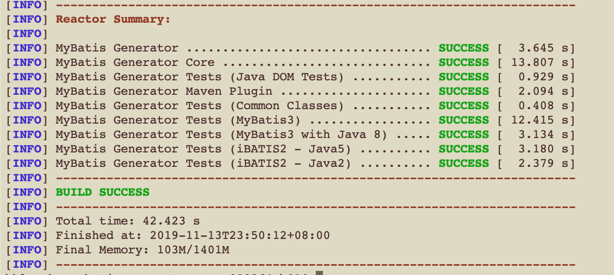

## 一、安装 mybatis-generator-crv 插件
下载到本地后，进入mybatis-generator项目目录， 执行
```$java
mvn clean install -DskipTests
```
执行成功后如图所示：



```$xslt
[INFO] ------------------------------------------------------------------------
[INFO] Reactor Summary for MyBatis Generator 1.3.7-crv1.0-SNAPSHOT:
[INFO] 
[INFO] MyBatis Generator .................................. SUCCESS [  5.993 s]
[INFO] MyBatis Generator Core ............................. SUCCESS [ 55.464 s]
[INFO] MyBatis Generator Tests (Java DOM Tests) ........... SUCCESS [  4.973 s]
[INFO] MyBatis Generator Maven Plugin ..................... SUCCESS [ 18.248 s]
[INFO] MyBatis Generator Tests (Common Classes) ........... SUCCESS [  2.251 s]
[INFO] MyBatis Generator Tests (MyBatis3) ................. SUCCESS [ 42.947 s]
[INFO] MyBatis Generator Tests (MyBatis3 with Java 8) ..... SUCCESS [  4.318 s]
[INFO] MyBatis Generator Tests (iBATIS2 - Java5) .......... SUCCESS [ 11.686 s]
[INFO] MyBatis Generator Tests (iBATIS2 - Java2) .......... SUCCESS [ 11.179 s]
[INFO] ------------------------------------------------------------------------
[INFO] BUILD SUCCESS
[INFO] ------------------------------------------------------------------------
[INFO] Total time:  02:37 min
[INFO] Finished at: 2020-06-19T16:49:01+08:00
[INFO] ------------------------------------------------------------------------

```
    
在微服务项目的pom.xml文件中引入 mybatis-generator插件配置。
```xml
<build>
    <finalName>${artifactId}-run</finalName>
    <plugins>
	...省略...
        <plugin>
            <groupId>org.mybatis.generator</groupId>
            <artifactId>mybatis-generator-maven-plugin</artifactId>
            <version>1.3.7-crv1.0-SNAPSHOT</version>
            <configuration>
                <configurationFile>./src/main/resources/generatorConfig.xml</configurationFile>
                <verbose>true</verbose>
                <overwrite>true</overwrite>
            </configuration>
            <dependencies>
                <dependency>
                    <groupId>mysql</groupId>
                    <artifactId>mysql-connector-java</artifactId>
                    <version>${mysql.version}</version>
                </dependency>
            </dependencies>
        </plugin>
        
    </plugins>
    ...省略...
</build>

```

编写generatorConfig.xml 文件, 并放入 src/main/resources 文件夹下。示例如下：
```xml


<?xml version="1.0" encoding="UTF-8"?>
<!DOCTYPE generatorConfiguration
        PUBLIC "-//mybatis.org//DTD MyBatis Generator Configuration 1.0//EN"
        "http://mybatis.org/dtd/mybatis-generator-config_1_0.dtd">

<!-- 配置Run As Maven build : Goals 参数 : mybatis-generator:generate -Dmybatis.generator.overwrite=true -->
<!-- 配置 tableName,使用 Run As Maven build 生成 dao model 层 -->
<generatorConfiguration>
    <!-- 配置文件路径
    <properties url="${mybatis.generator.generatorConfig.properties}"/>-->
    <!--数据库驱动包路径 -->
    <!--<classPathEntry location="D:\apache-maven-3.5.3\repository\mysql\mysql-connector-java\5.1.38\mysql-connector-java-5.1.38.jar"/>-->

    <context id="DB2Tables" targetRuntime="MyBatis3">

        <property name="javaFileEncoding" value="UTF-8"/>
        <!-- 生成model时使用lombok注解、并且不生成非Selective的Insert和Update -->
        <plugin type="org.mybatis.generator.plugins.LombokPlugin"/>

        <!--关闭注释 -->
        <commentGenerator>
            <property name="suppressAllComments" value="false"/>
        </commentGenerator>

        <!--数据库连接信息 -->
        <jdbcConnection driverClass="com.mysql.jdbc.Driver"
                        connectionURL="jdbc:mysql://10.239.181.39:8066/${数据库名}?characterEncoding=utf8&amp;useSSL=true&amp;tinyInt1isBit=false"
                        userId="${用户名}"
                        password="${密码}">
        </jdbcConnection>
        <!-- java类型解析器 可选配置 -->
        <javaTypeResolver>
            <property name="forceBigDecimals" value="false"/>
        </javaTypeResolver>

        <!--生成的model 包名及包路径 -->
        <javaModelGenerator targetPackage="cn.com.crv.wx.member.dal.entity"
                            targetProject="src/main/java">
            <property name="enableSubPackages" value="ture"/>
            <property name="trimStrings" value="true"/>
        </javaModelGenerator>

        <!--生成xml mapper文件 路径 -->
        <sqlMapGenerator targetPackage="mapper" targetProject="src/main/resources">
            <property name="enableSubPackages" value="ture"/>
        </sqlMapGenerator>

        <!-- 生成的Dao接口 的包路径 -->
        <javaClientGenerator type="XMLMAPPER" targetPackage="cn.com.crv.wx.member.dal.mapper"
                             targetProject="src/main/java">
            <property name="enableSubPackages" value="ture"/>
        </javaClientGenerator>

        <!--对应数据库表名，多个表，请复制指定，不需要的方法请关闭开关 -->
        <!--
          tableName:必须配置  指定表的名称
          domainObjectName：生成javabean对象的基本名称。如果未指定,MBG将自动基于表名生成。
          这个名字(无论是在这里指定,或自动生成) 。
          enableInsert：是否生成插入语句。默认是true
          enableSelectByPrimaryKey：是否通过主键生成选择语句。不管是否有这种设置,如果该表没有一个主键将不会生成。
          enableSelectByExample:是否应该生成通过example的选择语句。这个声明使得许多不同的动态查询是在运行时生成。
          enableUpdateByPrimaryKey：是否通过主键生成更新语句。如果该表没有主键，不管是否设置该属性,语句将不会生成。
          enableUpdateByExample：是否通过example对象生成更新语句。该语句将更新一个表中相匹配的记录。
          enableDeleteByPrimaryKey：是否通过主键生成删除语句。如果该表没有主键，不管这种设置该属性,语句将不会生成。
          enableDeleteByExample：是否通过example对象生成删除语句。这个声明使得许多不同的动态删除在运行时生成。
          enableCountByExample：是否通过example对象生成计算行数语句。该语句将返回一个表中的行数相匹配的example。
        -->


        <!--对应数据库表名，多个表，请复制指定，不需要的方法请关闭开关 -->
        <table tableName="t_order" domainObjectName="OrderDO" enableInsert="true"
               enableSelectByPrimaryKey="true"
               enableSelectByExample="true" enableUpdateByPrimaryKey="true"
               enableDeleteByPrimaryKey="true"
               enableDeleteByExample="true" enableCountByExample="true"
               enableUpdateByExample="true">
            <!-- 使用分布式主键生成工具(如：snowflake等)生成主键时，注释下面这行 -->
            <generatedKey column="id" sqlStatement="MySql" identity="true"/>
        </table>


    </context>
</generatorConfiguration>
 
```

进入微服务项目，执行mvn命令生成数据访问层（dal）类信息
```
mvn mybatis-generator:generate
```
 执行完成后， 效果如图所示：

```
INFO] ------------------------------------------------------------------------
[INFO] Reactor Summary for MyBatis Generator 1.3.7-kuroneko1.0-SNAPSHOT:
[INFO] 
[INFO] MyBatis Generator .................................. SUCCESS [  5.270 s]
[INFO] MyBatis Generator Core ............................. SUCCESS [ 22.387 s]
[INFO] MyBatis Generator Tests (Java DOM Tests) ........... SUCCESS [  1.726 s]
[INFO] MyBatis Generator Maven Plugin ..................... SUCCESS [  5.134 s]
[INFO] MyBatis Generator Tests (Common Classes) ........... SUCCESS [  1.139 s]
[INFO] MyBatis Generator Tests (MyBatis3) ................. SUCCESS [ 34.047 s]
[INFO] MyBatis Generator Tests (MyBatis3 with Java 8) ..... SUCCESS [  4.342 s]
[INFO] MyBatis Generator Tests (iBATIS2 - Java5) .......... SUCCESS [  4.737 s]
[INFO] MyBatis Generator Tests (iBATIS2 - Java2) .......... SUCCESS [  5.071 s]
[INFO] ------------------------------------------------------------------------
[INFO] BUILD SUCCESS
[INFO] ------------------------------------------------------------------------
[INFO] Total time:  01:24 min
[INFO] Finished at: 2020-06-19T17:17:12+08:00
[INFO] ------------------------------------------------------------------------

```